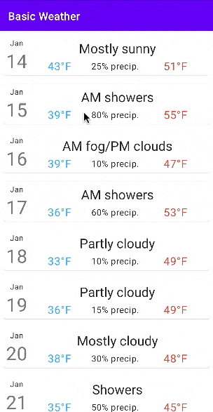

# Assignment 1
**Due by 11:59pm on Monday, 1/24/2022**  
**Demo due by 11:59pm on Monday, 2/7/2022**

In this assignment, we'll get our toes wet in the pond of Android development by writing the beginnings of a simple weather app.  To do this, we'll start working with `RecyclerView`, which is the best way to write efficient and scalable dynamic list-based user interfaces.  The parts of the assignment are outlined below.  This screen capture depicts roughly what the app should look like (though you don't have to exactly match the styling here) and how it should behave:

## 1. Sign up for Campuswire

This first part of this assignment is simple and doesn't involve coding.  Just join our course on Campuswire using your ONID email address.  I already sent an email invite to join our Campuswire course to your ONID email address.  Alternatively, you can also find a link and invite code to join Campuswire on the homepage of our Canvas site for the course.  If you have trouble connecting to our course on Campuswire, please catch up with me after lecture or drop into my office hours, and I’ll help you join.

We'll be using Campuswire as our main communication platform for the course.  Campuswire has both a StackOverflow-style Q&A forum, called the “class feed”, as well as live chat rooms, so it should hopefully fulfill all of our course communication needs.  For this reason, please use Campuswire exclusively for questions you have about the course.  I (Hess) and the TAs will be on Campuswire, just like you and your fellow students, so you can feel confident about getting the answers you need there.

I strongly encourage you to also spend time answering your fellow classmates’ questions on Campuswire. This will not only enable everyone to get help quickly, but it will also help you improve your understanding of the material, since teaching someone else is the best way to learn something.  As an extra incentive to answer questions on Campuswire, extra credit will be awarded to the most active Campuswire participants at the end of the course (based on Campuswire’s reputation score).

## 2. Write a basic app to display dummy weather data

This repository contains an initial template for an Android app.  Currently, the app contains one extremely basic "hello world" activity.  Your job in this assignment is to modify this activity to create the beginnings of a basic weather app.  Here's what you need to do to accomplish this:

  * Create a custom Kotlin class to represent the weather forecast for a specific day or other period of time.  This class should have properties to represent the following forecast data (at a minimum; feel free to include more forecast data if you want):
    * The date/time associated with the forecast being represented.
    * The high and low temperatures for the forecast period.
    * The probability of precipitation associated with the forecast period (e.g. 75%).
    * A short description of the weather associated with the forecast period (e.g. "Sunny and warm").
    * A longer version of the weather description (e.g. "Cloudless and generally warm, with a high of 75F and a low of 57F.  Some high clouds late in the day.").

  * Allocate a list of 10-15 objects of the custom class you just created, and initialize it with some hard-coded, dummy weather data.

  * Use the `RecyclerView` framework to display the entire array of forecast data as a scrollable vertical list of cards.  To accomplish this, you'll need to do the following:
    * Add a `RecyclerView` widget to the main activity's layout.
    * Create a new layout defining a card that depicts a single forecast element in your array.  This card should display all of the information contained in the forecast object *except the long version of the forecast*, which we'll use later.  Try to make your card look as good as you can.  For example, add margins, borders, and padding as appropriate to create space inside and around the card and its elements, and try to organize the information displayed in each card in an intuitive and visually appealing way.  If you like, try to use some of the principles from the following articles when you're styling your card:
      * [Android styling: themes vs styles](https://medium.com/androiddevelopers/android-styling-themes-vs-styles-ebe05f917578)
      * [Android styling: common theme attributes](https://medium.com/androiddevelopers/android-styling-common-theme-attributes-8f7c50c9eaba)
    * Write a class that extends `RecyclerView.Adapter`.  Within this class, you will:
      * Implement an inner class that extends `RecyclerView.ViewHolder`.  Objects of this class will represent individual items in your forecast list.
      * Write methods to bind weather forecast data from your array to your view holder objects.  These methods will be used to make sure the list stays up to date as the user scrolls.
    * Within your main activity's `onCreate()` method, create a new layout manager and connect it to the `RecyclerView`.  Then, create a new object of your adapter class and attach that to the `RecyclerView`.  Make sure to store your dummy weather forecast data in the adapter.

  Importantly, the app you write should not have any extraneous components.  For example, you should not include a text entry box and/or a button like we did in the app we wrote in lecture, since the user will not have to provide any input for this app.

## 3. Handle user clicks on items in the weather list

Finally, you should add functionality that handles clicks on weather forecast elements in your `RecyclerView` list.  Specifically, modify your main activity and/or adapter class so that, when the user clicks on one of the weather forecast elements in your list, a [`Snackbar`](https://developer.android.com/training/snackbar) is displayed that contains the longer version of the forecast description corresponding to the list item that was clicked.  Note that to do this, you'll have to listen for clicks on the `RecyclerView` view holders themselves (specifically to the `View` associated with the view holder).  You can attach a click listener to these elements in much the same way we attached one to a button in lecture.

## Submission

We'll be using GitHub Classroom for this assignment, and you will submit your assignment via GitHub.  Make sure your completed files are committed and pushed by the assignment's deadline to the master branch of the GitHub repo that was created for you by GitHub Classroom.  A good way to check whether your files are safely submitted is to look at the main/master branch your assignment repo on the github.com website (i.e. https://github.com/osu-cs492-w22/assignment-1-YourGitHubUsername/). If your changes show up there, you can consider your files submitted.

## Grading criteria

The assignment is worth 100 total points, broken down as follows:

  * 20 points: Signed up for Campuswire

  * 80 points: Basic weather app implemented as described above
    * 50 points: correctly uses the `RecyclerView` framework to display dummy weather forecast data on screen in a scrollable list of nicely-styled cards
    * 10 points: interface does not contain extraneous elements (e.g. buttons, text entry boxes, etc.)
    * 20 points: successfully displays detailed weather forecast in a `Snackbar` in response to user clicks on forecast items in the list, as described above
